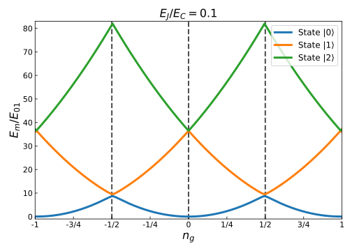
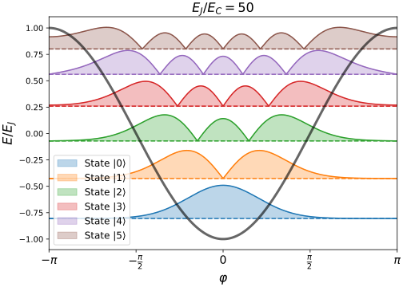
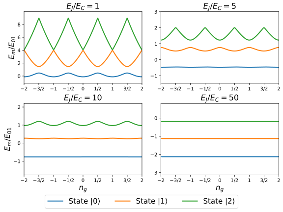

# physical-systems-for-quantum-computing

> Work in progress / Unpublished.

This repository contains the Python scripts necessary to create some of the figures of my Physics degree end-of-degree project at the University of Alicante, which is supervised by [Joaquín Fernández Rossier](http://jfrossier.blogspot.com/) and is titled "Physical Systems For Quantum Computing". The base program was originally made by Joaquín for a class about quantum tunneling, quantum scattering and bounded states in a course on Quantum Mechanics. I edited and extended the program for adapting it to the transmon qubit and the Cooper pair box qubit. 

### Methods

To obtain the energy eigenstates of the qubits, the [transmon_and_cpb.py](transmon_and_cpb.py) script solves the Schrödinger equation using the following Hamiltonian:

For further reference on this Hamiltonian you can check [this section of the Qiskit textbook](https://qiskit.org/textbook/ch-quantum-hardware/transmon-physics.html).

For creating the figures, the [transmon_and_cpb.py](transmon_and_cpb.py) script is used by the [main_transmon_and_cpb.py](main_transmon_and_cpb.py) script as a module. The latter script is used for defining parameters and calling the functions from [transmon_and_cpb.py](transmon_and_cpb.py).

### Image gallery 

The created figures are the following ones:

| | |
| ------------- | ------------- |
| | |

