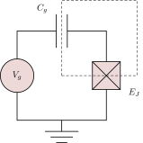
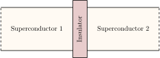
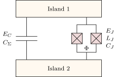
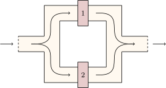

# physical-systems-for-quantum-computing

This repository contains the Python scripts necessary to create some of the figures of my Physics degree end-of-degree project at the University of Alicante, which is supervised by [Joaquín Fernández Rossier](http://jfrossier.blogspot.com/) and is titled "Physical Systems For Quantum Computing". The base program was originally made by Joaquín for a class about quantum tunneling, quantum scattering and bounded states in a course on Quantum Mechanics. I edited and extended the program for adapting it to the transmon qubit and the Cooper pair box qubit. 

In addition to this, the TikZ diagrams created in LaTeX for the superconducting qubits section of the end-of-degree project can be found at the [tikz](tikz) folder of this repository. In this folder, the tex source code, svg and pdf files of the diagrams can be found.

The main document of the end-of-degree project can be found at the RUA of the University of Alicante using the following link:

http://hdl.handle.net/10045/115887

The document is licensed under the terms of a Creative Commons Attribution-NonCommercial-NoDerivatives 4.0 license.

### Methods

To obtain the energy eigenstates of the qubits, the [transmon_and_cpb.py](transmon_and_cpb.py) script solves the Schrödinger equation using the following Hamiltonian:

$$
\hat{H} = 4E_C (\hat{n}-n_g)^2 - E_J \cos\hat{\phi}\,.
$$

For further reference on this Hamiltonian you can check [this section of the Qiskit textbook](https://qiskit.org/textbook/ch-quantum-hardware/transmon-physics.html).

For creating the figures, the [transmon_and_cpb.py](transmon_and_cpb.py) script is used by the [main_transmon_and_cpb.py](main_transmon_and_cpb.py) script as a module. The latter script is used for defining parameters and calling the functions from [transmon_and_cpb.py](transmon_and_cpb.py).

### Image gallery 

The created figures are the following ones:

**Python plots**
| | |
| ------------- | ------------- |
| | |

**TikZ Diagrams**
| | |
| ------------- | ------------- |
| |  |

